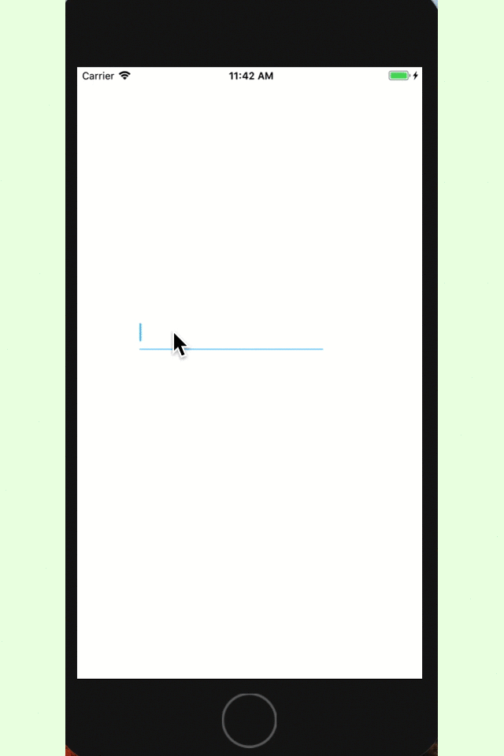

# TYTextField
==A Simple Customized UITextFiled==

## Installation

* Using Cocoapods: ```Pod 'TYTextField'```

## Usage

* Init a TYTextField instance. ```let tf = TYTextField()```
* Point the postion of it. ```tf.frame = CGRect(x: 75, y: 300, width: 250, height: 40)```
* Add to super view
* Use ```tf.showCorrectHint()``` to indicate valid input
* Use ```tf.showErrorHint()``` to indicate invalid input
* Use ```tf.ClearHint()``` to clear right view

## Gif



## Code Snippet

```swift
    override func viewDidLoad() {
        super.viewDidLoad()
        let tf = TYTextField()
        tf.addTarget(self, action: #selector(valueChanged), for: .editingChanged)
        tf.frame = CGRect(x: 75, y: 300, width: 250, height: 40)
        view.addSubview(tf)
    }
    
    @objc func valueChanged(sender: TYTextField) {
        if sender.text == "this is a test" {
            sender.showCorrectHint()
        } else if sender.text == "" {
            sender.clearHint()
        } else {
            sender.showErrorHint()
        }
    }

```